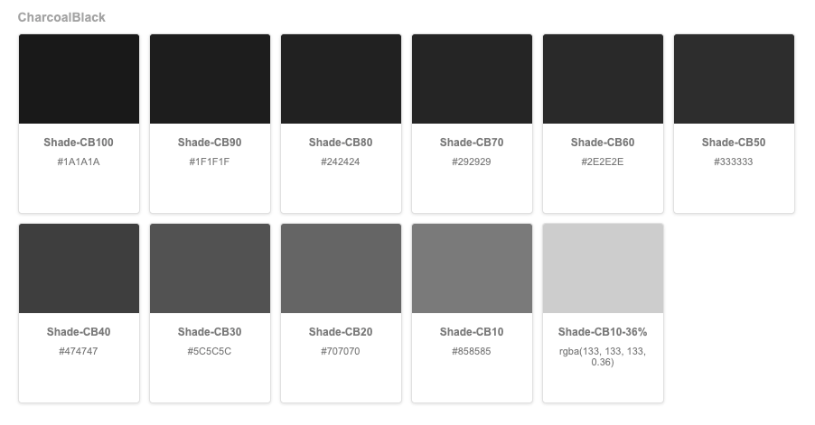

## Color Palette Box



React Components for display color palette name.
It can use in React App or can use in MDX storybook docs.

### Documentation

**npm**
```
npm install color-palette-box
```

**yarn**
```
yarn add color-palette-box
```

**example**
```
# create a list of your colors
const list = [
  {
    name: 'color #1',
    bgColor: '#000000',
    desc: 'description here' // optional
  },
  {
    name: 'color #2',
    bgColor: '#DFDFDF',
    desc: 'description here' // optional
  }
]


<ColorPaletteGroup title="title is optional">
  {
    list.map(( color, index ) => {
      return (
        <ColorPaletteGroupItem name={color.name} bgColor={color.bgColor} key={index} />
      )
    })
  }
</ColorPaletteGroup>
```